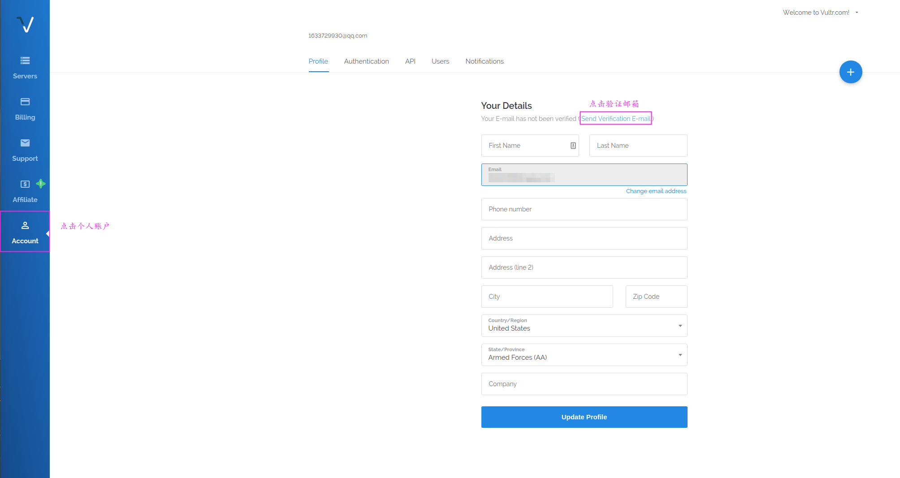
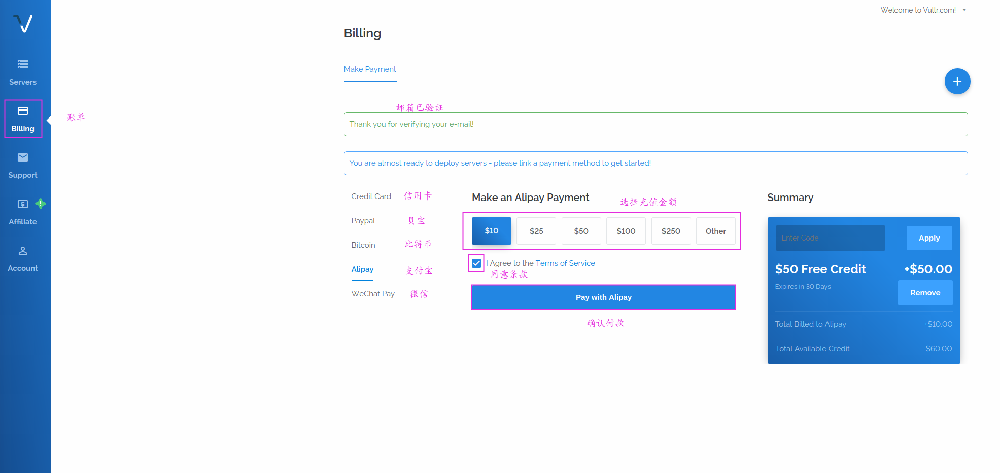

# 树莓派做 DNS 服务器以及网关，实现自由上 Google
首先声明，本教程的实验环境为树莓派，理论上只要是 Linux 系统就可以，可能细节步骤有所差别，本教程用到的所有软件都是网络上开源软件，请用户自行判断风险。本文提供一种应用方法，教程仅限于交流学习，禁止用于非法用途。

## 服务器配置

首先，我们想要上 Google，需要有一个可以上 Google 的服务器，我们就可以通过服务器中转来访问 Google YouTube 等网站。

这里服务器推荐 Vultr，这是一个服务器运营商，本人测试访问 Google YouTube 等国外主流网站的速度很快，价格也比较合理，

### 注册

首先，我们需要在 [Vultr](https://www.vultr.com/?ref=8038470) 注册一个账号，填上邮箱和密码，就可以创建账号了

注意，你的密码如果设置比较简单，会跳转到如下页面，那么按照要求创建个比较复杂的密码吧。

接下来，需要我们进行邮箱验证，点击个人账户，发送验证邮件，然后登录自己的邮箱点击验证链接就可以了

如果验证成功，那么我们就马上创建属于我们的服务器啦。首先需要给我们的账户里充值，才可以构建服务器，点击账单，这里我们先充值 10 美元

接下来我们要创建服务器了，点击当前页面的 "加号"

我们来选择服务器的机房以及容量等信息

