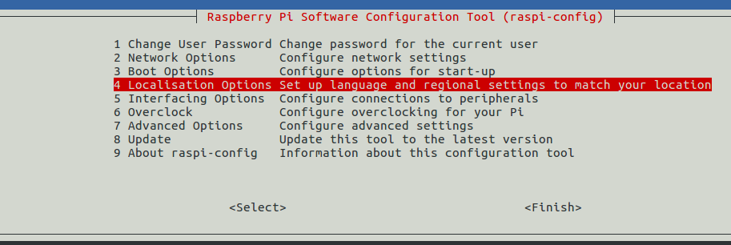

# 树莓派做 DNS 服务器以及网关，实现自由上 Google

首先声明，本教程的实验环境为树莓派，理论上只要是 Linux 系统就可以，可能细节步骤有所差别。教程仅限于交流学习，禁止用于非法用途。


## 服务器配置

首先，我们想要上 Google，需要有一个可以上 Google 的服务器，我们就可以通过服务器中转来访问 Google YouTube 等网站的请求。


如果你已经有服务器了并配置好 v2ray 软件，可以忽略下面的链接。如果你还没有一个能访问 Google 的服务器，这里器推荐 Vultr，本人测试访问 Google YouTube 等国外主流网站的速度很快，价格也比较合理。

[Vultr 注册以及创建服务器安装配置 V2ray](./vultr.md)


## 树莓派配置


### 安装系统

树莓派系统我们选择了比较轻量稳定的 [Raspbian Stretch Lite](https://www.raspberrypi.org/downloads/raspbian/) 系统，具体安装教程如下

[树莓派安装 Raspbian Stretch Lite 系统](./raspberry_pi_install.md)


### 环境配置

树莓派系统中默认是不支持 SSH 的，中文显示也乱码，我们需要配置一下。首先，将树莓派连接屏幕开机并联网（建议直接插网线，因为后面做 DNS 服务器需要长期开机，网线比较稳定）。默认的用户名是 `pi`，默认密码是 `raspberry`（注意输入密码的时候屏幕是没有显示的，输完直接按回车就可以）


因为默认的密码不太安全，所以我们首先修改下默认密码，输入 `sudo passwd pi` 会提示你输入新密码，输入后会提示你再次输入，然后就会设置成功（后面提示要密码的地方输入你新设置的密码就可以了）


#### 开启 ssh

使用命令：`sudo raspi-config`，上下方向键选择 `Interfacing Options`


选择 SSH

开启 SSH


按 tab 键盘选择 Finish，完成设置


##### 支持中文显示

树莓派默认不支持中文，需要我们配置一下编码，执行 `sudo raspi-config`，选择 Localisation Options



选择 Change Locale


上下移动到 `en_US.UTF-8 UTF-8` , `zh_CN.GBK GBK`, `zh_CN.UTF-8 UTF-8` 按空格勾选（有 `*` 号代表选中），然后按 Tab 键选择 OK


默认系统语言我们选择 `en_US.UTF-8`


按 tab 键盘选择 Finish，完成设置


安装中文库，在命令行输入：

```
sudo apt-get update
sudo apt-get upgrade -y
sudo apt-get install ttf-wqy-zenhei
```

现在我们的树莓派环境已经配置好了，输入 `sudo reboot`重启生效


### 安装依赖

```
sudo apt-get install ssh curl git vim dnsmasq tmux ipset ttf-wqy-zenhei dnsutils lsof proxychains -y
```

接下来安装 V2ray 客户端，执行

```
wget https://install.direct/go.sh && sudo bash go.sh
```


### 配置 dnsmasq

我们使用 dnsmasq 来做 DNS 解析服务，dnsmasq 适用于个人用户或少于50台主机的网络，对于个人或者家庭使用够了

首先备份一下旧的配置文件

```
sudo cp /etc/dnsmasq.conf /etc/dnsmasq.conf.bak
```

编辑 `/etc/dnsmasq.conf` 填充为以下内容：

```
no-resolv # 不使用 /etc/resolv.conf 做 dns 解析
cache-size=5000
server=127.0.0.1  
server=114.114.114.114 # 国内默认使用 114.114.114.114 来进行 dns 解析
conf-dir=/etc/dnsmasq.d
```

>  注：编辑文件方法请自行查阅文档，例如 vim


### 配置 ipset 

我们使用 ipset 将需不能直接访问的网址的 `IP` 加到集合里，通过服务器访问。

```
git clone https://github.com/cokebar/gfwlist2dnsmasq.git
cd gfwlist2dnsmasq/
bash gfwlist2dnsmasq.sh -o gfwlist.conf -s gfwlist -p 5353 # -o 为输出文件， -s 为设置 ipset 集合名，-p 为 dns 端口
sudo cp gfwlist.conf /etc/dnsmasq.d/
```

我们来看一下生成的文件：  

```
server=/030buy.com/127.0.0.1#5353
ipset=/030buy.com/gfwlist
server=/0rz.tw/127.0.0.1#5353
ipset=/0rz.tw/gfwlist
server=/1000giri.net/127.0.0.1#5353
ipset=/1000giri.net/gfwlist
...
```

- `server=..../127.0.0.1#5353`  意思是碰到这个域名，交给本机 5353 端口来进行 DNS 解析处理
- `ipset=/.../gfwlist` 表示将这个域名解析出来的 ip 加到名字为 gfwlist 的 ipset 集合中 


这样，我们很容易想到透明代理方案： 

- 首先监听 5353 端口来将这些域名解析成真正的 ip。然后将解析出来的 ip 加到名字为 gfwlist 的集合中。
- 假设我们 V2ray 代理程序监听 2000 端口，作用是把各种类型的请求发给服务器，让服务器完成真正的请求。那么我们可以写一条规则，如果访问的 ip 在 gfwlist 中，那么直接将该请求转发到 2000 端口。


上面我们已经为常用的国外网站配置了 ipset，那么我们重启一下 dnsmasq 服务使其生效

```
sudo systemctl enable dnsmasq.service
sudo systemctl restart dnsmasq.service
sudo systemctl status dnsmasq.service # 如果状态正常，再继续进行下面步骤(按 q 退出)
```


### V2ray 客户端配置


将 [config.json](./conf/config.json) 文件拷贝到 `/etc/v2ray/config.json`，要注意需要修改配置文件中的服务器 `ip`, `id` 以及 `port` 参数，主要参数含义如下：


我们首先要把树莓派默认的 dns 服务器给禁用：

```
sudo systemctl stop avahi-daemon
sudo systemctl disable avahi-daemon
sudo reboot
```

重启后我们测试下 v2ray 客户端

```
sudo systemctl enable v2ray.service
sudo systemctl start v2ray.service
sudo systemctl status v2ray.service # 如果状态正常，再继续进行下面步骤(按 q 退出)
```


### 开启端口转发

如果我们想把访问国外 ip 的请求转发到 2000 端口，需要开启端口转发，首先编辑 `/etc/sysctl.conf`，找到下面的这一项，把注释去掉：

```
# 找到下面这一项，把前面注释号#去掉，变成：
net.ipv4.ip_forward = 1
```

让上述修改立刻生效：

```
sudo sysctl -p
```


### 配置 iptables 规则


我们需要让系统知道，把什么样的数据转发到 2000 端口，交给服务器请求，所以需要配置 iptables 规则，新建 `iptables.rule` 内容如下：  

```
#!/bin/bash

EXTIF="eth0" # 连接外网的网卡

PATH=/sbin:/usr/sbin:/bin:/usr/bin:/usr/local/sbin:/usr/local/bin; export PATH

iptables -F # 清除所有已制定的规则
iptables -X # 杀掉所有使用者 “自定义” 的 chain (tables)
iptables -Z # 将所有的 chian 计数与流量统计归零
iptables -P INPUT   ACCEPT
iptables -P OUTPUT  ACCEPT
iptables -P FORWARD ACCEPT

iptables -F -t nat
iptables -X -t nat
iptables -Z -t nat
iptables -t nat -P PREROUTING  ACCEPT
iptables -t nat -P POSTROUTING ACCEPT
iptables -t nat -P OUTPUT      ACCEPT

ipset -N gfwlist iphash # 新建一个名字为 gfwlist 的 ip 散列集合
iptables -t nat -A POSTROUTING -s 192.168.1.0/24 -o $EXTIF -j MASQUERADE # 将该网段的请求都转发的 $EXTIF 网卡 (一般是连接外网的网卡)
# 如果发现由其它网卡转发过来请求的 ip 与 gfwlist 中的 ip 匹配，转发到 2000 端口
iptables -t nat -A PREROUTING -p tcp -m set --match-set gfwlist dst -j REDIRECT --to-port 2000
# 本网卡请求的 ip 与 gfwlist 中的 ip 匹配，转发到 2000 端口
iptables -t nat -A OUTPUT -p tcp -m set --match-set gfwlist dst -j REDIRECT --to-port 2000
```

注意要修改 `eth0` 为你的树莓派有线网卡名称（用 `ifconfig` 命令可以看到），其次要注意网段转发的部分，我配置了 `192.168.1.0/24` 网段，这个用 `ifconfig` 命令看你的 ip 就能看出来你是什么网段的


执行该脚本：  

```
sudo bash iptables.rule
# 验证是否执行成功
sudo iptables-save # 如果有上面那些规则就是设置成功了
```


如果规则已经设置成功，现在我们首先执行 `dig google.com` 来看看 dns 解析是否正常（dig 命令是一个用于询问 DNS 域名服务器的灵活的工具。它执行 DNS 查询，显示从已查询名称服务器返回的应答。) 

**这里需要注意，v2ray 刚启动就立刻执行 dig 命令可能无法解析 dns，如果上一条命令显示无法解析 google，可以重启等 5 分钟再试试）** 如果能解析域名了，那么试试 `curl google.com`，看看是否可以获取到服务器数据，如果可以，那么我们的 树莓派 DNS 服务器就已经配置完了，下面我们配置一下开机自启动


### 开机启动

首先我们把 iptabables.rule 移动到系统目录，防止以后被不小心改乱了，本人挪到了 `/etc/kaka/` 下，切换到 root 用户，树莓派默认无法登录 root 用户，需要给 root 用户设置密码后才能切换：  

```
sudo passwd
```

使用 `su` 切换到 root 用户，执行 `crontab -e`，填写如下内容：

```
SHELL=/bin/bash
PATH=/usr/local/sbin:/usr/local/bin:/sbin:/bin:/usr/sbin:/usr/bin

@reboot cd /etc/kaka/ && bash iptables.rule
```

同时经过上面的步骤，我们的 v2ray 和 dnsmasq 应该是开机自启的服务，那么我们可以重启试一下。 重启后使用 `dig google.com` 和 `curl google.com` 如果能获取到数据，那么我们自启动也配置成功（**别忘了刚开机可能无法立即解析 dns，解析不到检查一下 v2ray 和 dnsmasq 服务是否正常启动以及 iptables 是否设置成功，都是正常的那就等 5 分钟再试试**）


## 客户端配置

### Windows


### Linux

首先编辑 `/etc/resolv.conf` 设置 DNS，将文件内容改为树莓派 ip：


设置默认的网关为树莓派的 ip：

```
sudo route add default gw 192.168.1.152
```


### Android

一般来说长按 WIFI 会出现高级选项，IP 不用变，DNS 和 网关设置为树莓派的 IP

