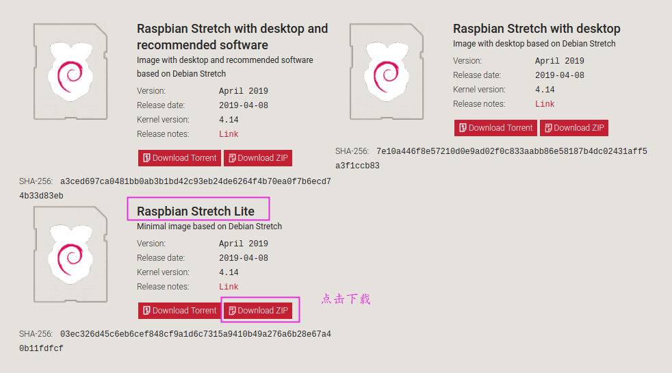
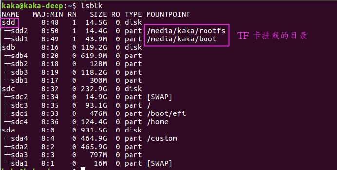

# 安装 Raspbian Strech Lite 系统

## 镜像下载

### 官方链接

[Raspbian Stretch Lite](https://www.raspberrypi.org/downloads/raspbian/)官方下载步骤如下：




### 个人链接

以下是我自己按照教程步骤做完后打包的镜像，如果你选择用这个镜像安装系统（需要你的 TF 卡是 16G 或者 16G 以上），那么只需要把 `v2ray.conf` 文件替换成自己的并且核对一下 iptables.rule 就行（详细步骤参考[树莓派配置](./README.md)的v2ray 和 iptables 配置部分)

因为我用的 dd 命令做的镜像，所以比较大

## 系统安装

首先把下载的镜像解压，得到一个 img 镜像


### Windows 安装

在 Windows 下，推荐使用 rufus 软件来安装系统，下载链接如下：

```
链接: https://pan.baidu.com/s/13BGRqf2l3CXNqXzfX9IRyQ 

提取码: x51r 
```

首先准备一个 8G 或 8G 以上容量的 tf 卡，通过读卡器插到电脑上，打开软件，设备选择自己的 TF 卡，镜像选择刚刚的解压出来的镜像：


## Linux 安装

首先执行 `lsblk`查看当前的硬盘，看到我们一共有 3 块硬盘 `sda`, `sdb`, `sdc`


现在插入 TF 卡再次执行 `lsblk`



发现多出来一个 `sdd`，那么 sdd 就是我们的 TF 卡，如果你的 TF 卡自动挂载到某个目录（也就是上图的提示部分），那么需要先卸载目录，命令如下（注意目录是你自己机器挂载的目录，如果没有挂载到目录，就不用执行下面这两条命令）

```
sudo umount /media/kaka/rootfs
sudo umount /media/kaka/boot
```

将解压好的 img 镜像拷贝到 TF 卡中（一定要注意下面的 if 后面是你下载的镜像目录，of 是要拷贝到的地方，我的 TF 卡是 sdd，所以是 `/dev/sdd`，你要根据自己机器的实际情况来填写）

```
dd bs=4M if=/home/kaka/2019-04-08-raspbian-stretch-lite.img of=/dev/sdd conv=fsync
```

