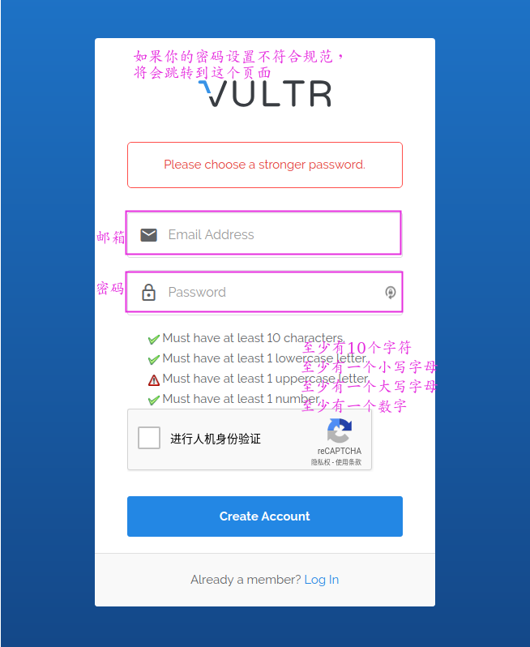
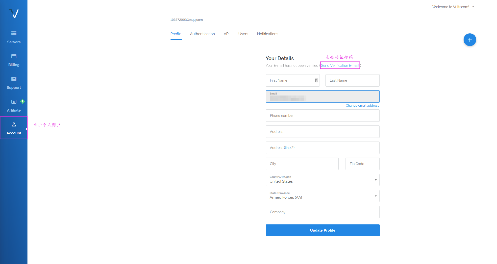
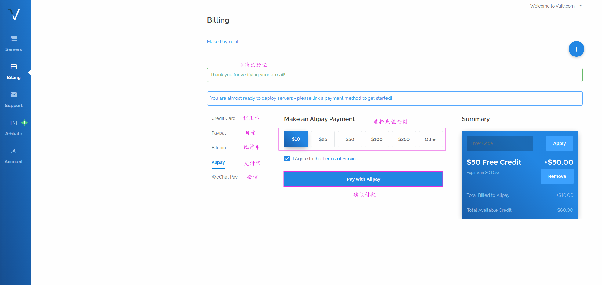
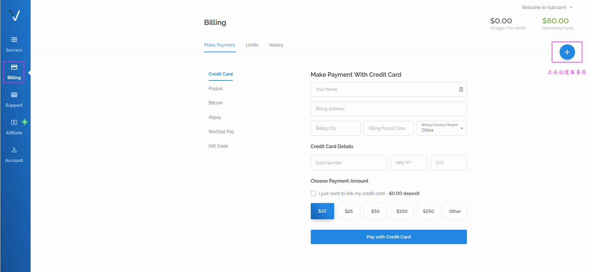
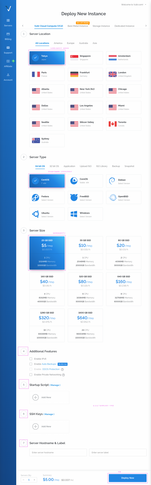
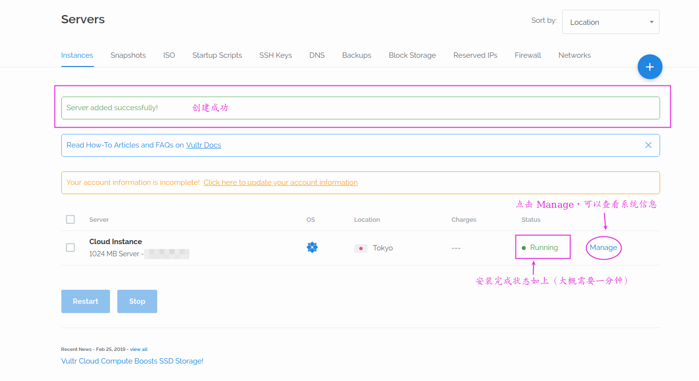
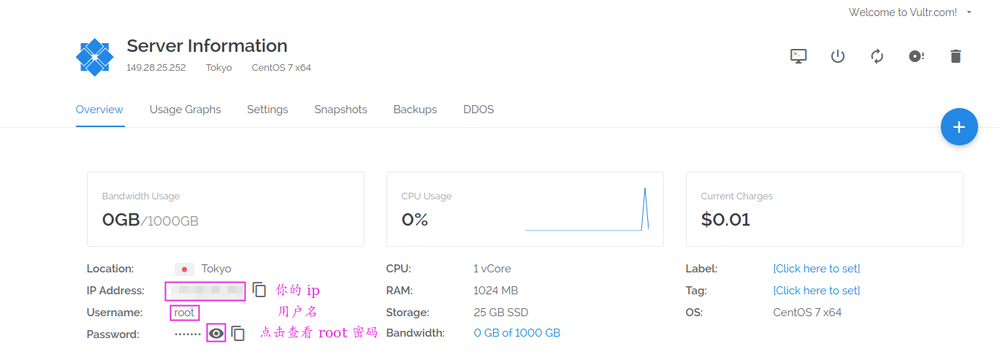

### 注册 Vultr

首先，我们需要在 [Vultr](https://www.vultr.com/?ref=8038470) 注册一个账号，填上邮箱和密码，就可以创建账号了

注意，你的密码如果设置比较简单，会跳转到如下页面，那么按照要求创建个比较复杂的密码吧。

接下来，需要我们进行邮箱验证，点击个人账户，发送验证邮件，然后登录自己的邮箱点击验证链接就可以了

如果验证成功，那么我们就马上创建属于我们的服务器啦。首先需要给我们的账户里充值，才可以构建服务器，点击账单，这里我们先充值 10 美元

### 创建服务器

接下来我们要创建服务器了，点击当前页面的 "加号"

我们来选择服务器的机房以及容量等信息

现在我们应该会跳到系统安装界面：

点击 Manage，可以查看系统的一些信息

这里的 ip 和密码一会要用到

### 远程连接服务器

