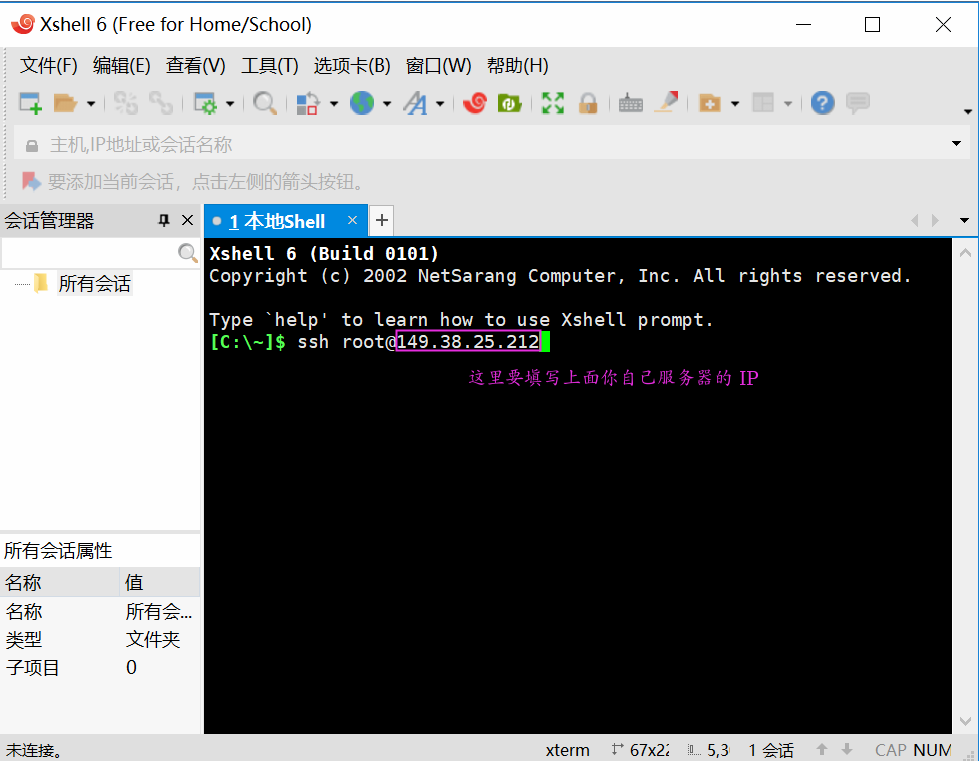
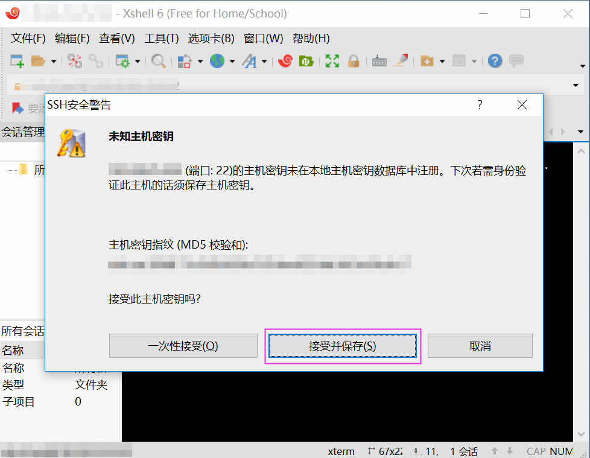
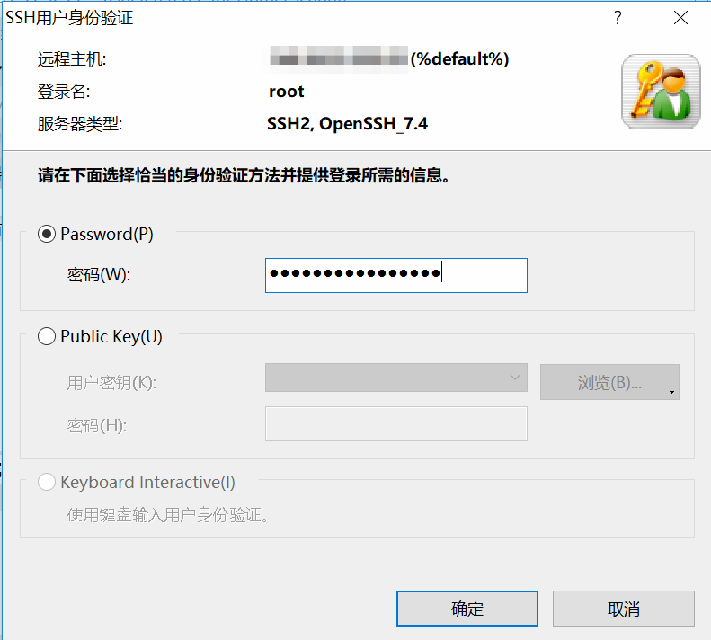
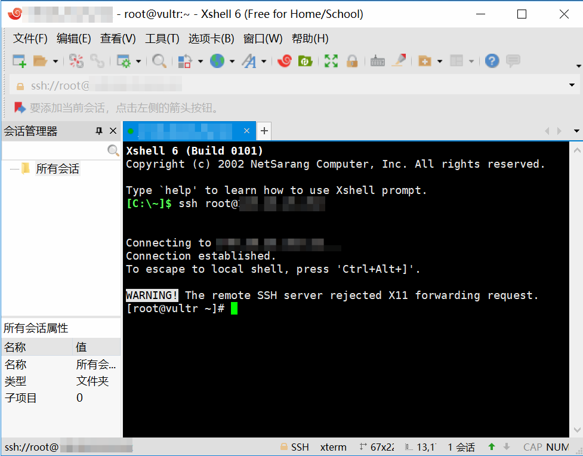
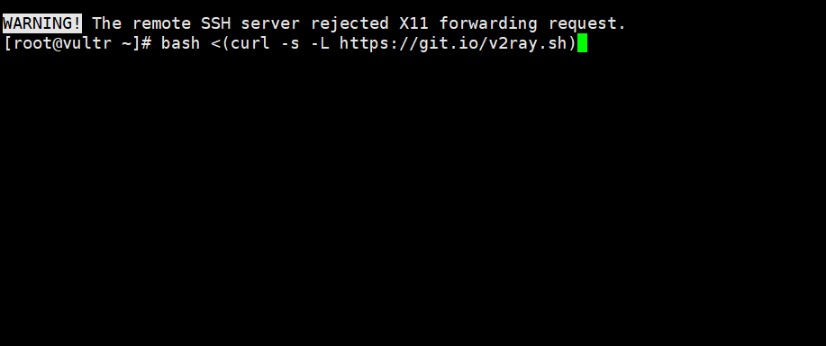
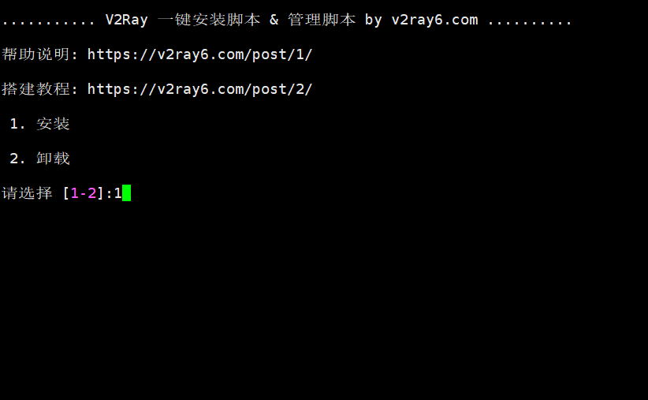
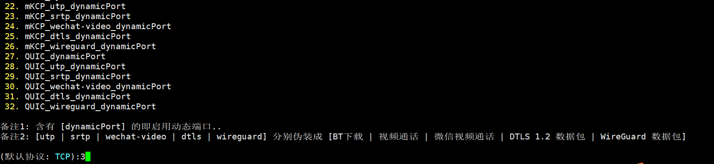
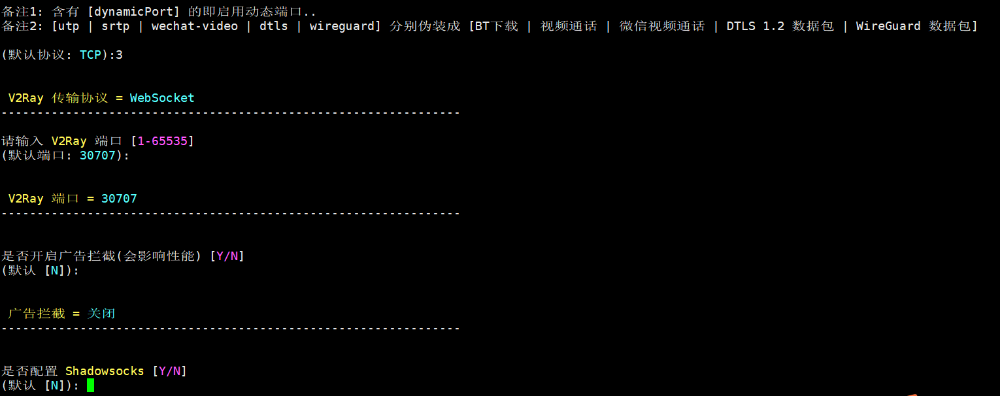
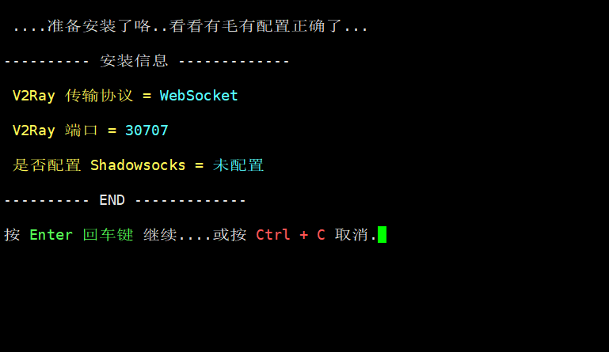
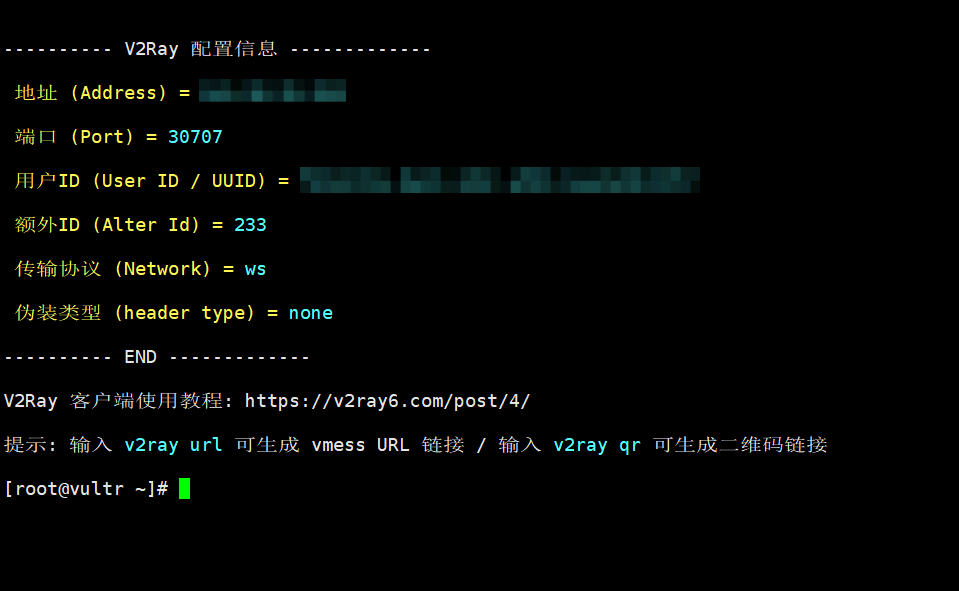

### 注册 Vultr

首先，我们需要在 [Vultr](https://www.vultr.com/?ref=8038470) 注册一个账号，填上邮箱和密码，就可以创建账号了


注意，你的密码如果设置比较简单，会跳转到如下页面，那么按照要求创建个比较复杂的密码吧。


接下来，需要我们进行邮箱验证，点击个人账户，发送验证邮件，然后登录自己的邮箱点击验证链接就可以了


如果验证成功，那么我们就马上创建属于我们的服务器啦。首先需要给我们的账户里充值，才可以构建服务器，点击账单，这里我们先充值 10 美元


### 创建服务器

接下来我们要创建服务器了，点击当前页面的 "加号"


我们来选择服务器的机房以及容量等信息


现在我们应该会跳到系统安装界面：


点击 Manage，可以查看系统的一些信息


这里的 `IP` 和 `密码` 一会要用到


### 远程连接服务器

首先，我们需要有连接服务器的软件，Windows 下推荐使用 XShell，链接如下：

```
链接：https://pan.baidu.com/s/1FAS9bQaDC6lVzYXNiikATg 
提取码：1bvq 
```

软件打开界面如下，我们输入要连接的服务器，命令如下 `ssh root@149.38.25.212`，其中 `149.38.25.212` 是上面你服务的 IP



输入回车后，会出现如下界面，点击接受并保存：



接下来会让我们输入密码，我们输入上面的服务器的密码并确定：



出现如下界面，说明我们已经成功连接到服务器：




### 安装 V2ray

首先执行 `bash <(curl -s -L https://git.io/v2ray.sh)，回车  `



选择 1，安装：



通信协议选择 3，WebSocket。注意，你的选项可能和我不一样，要选择 WebSocket 对应的数字：



下面的一直按回车就行：



注意你的 v2ray 端口可能和我不一样



最后如果出现如下界面，说明安装完成，要保存下面信息，一会有用

